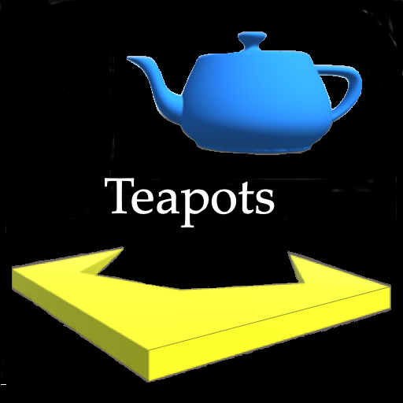

# Tempest in a Teapot Read Me

## Overview:    
Inspiration for Tempest in a Teapot was originally the 1981 Atari coin-op arcade game, Tempest, by David Theurer.  In 1983, Keithen began a conversion for the Atari 5200 game system, but it was not finished until resurrected by [Atari Age](https://atariage.com/store/index.php?l=product_detail&p=1036), which had him finish it in 2013. Later Keithen was working on cross-platform versions of virtual reality using Dr. Newell's famous Utah teapot when the idea came to combine the two concepts into Tempest in a Teapot.

The plan is to build this app in two phases. First build only the flying teapots and release that as a stand-alone game. Then add the Tempest levels inside each teapot for Tempest in a Teapot.

## Build Instructions
### Build with Unity 2020.3.2f1
* Pull from [GitHub](https://github.com/keithen/TempestInATeapot).
* Launch Teapots in Unity.
* Select File -> Build Settings
* Choose platform to build for and play on: 
    * Create for PC since we are building on that platform so it should be easy.
    * WebGL puts version online for evaluation of proof of concept.
    * Main build target is mobile apps, so Android and iOS.
    * Ultimate build will be VR versions of these platforms.
* Press "Build and Run"

### Installation
* WebGL
* Android
* iOS
* cardboard VR
* DayDream VR
* Oculus VR
 
 ## Game Play: 
 Tempest in a Teapot is a casual game played in two different phases: We start out in the teapot scene which has a field of teapots that we may shoot up to score points The second phase is the tempest scene which we can get to by flying down the spout of a teapot Once inside, we play a level from the tempest arcade game that will score many more points than can be gained by simply shooting up the teapots in phase one.
 
 ### Teapot Level
 Tempest. Each Tempest level is housed in it's own teapot and the teapots are grouped into VR astroid fields. Each 16 fields in Tempest are colored the same to indicate the difficulty of the level. The teapots will be color coordinated to match the field inside. We begin flying among the teapots and may destroy them by shooting them up. It will take multiple shots to destroy each teapot. The teapots will grow lighter with each hit until it reaches white hot color and the teapot goes super nova yielding 1000 points. In this scene the ship also gets multiple hits before being destroyed. It turns darker with each hit until not only the ship, but the entire scene goes black. However, if we fly down a teapot spout we are able to earn a lot more points playing a classic level of Tempest. The spout is a tube which has enemy shapes streaming up out of the bottom which must be destroyed.
 
 ### Tempest Level
 The game play view is always out the front window of our ship. In the bottom is a clawlike gun that fires charges. (The original Tempest arcade game was vector based with no built in collision detection, so the bullets were described as charges that would destroy enemy in a zone without direct contact.) The main view will include a heads up display with the score, number of lives remaining, ammunition level, and a proximity glow to indicate the direction to the nearest teapot. Touching the input will trigger one charge to shoot out straight ahead, so you must fly your ship in order to aim the gun. Ammunition will be replentished at a fixed rate. The main goal of the game is to build up the hightest score.
 Game play begins looking out at the astroid field with 16 teapots in it. Lean to steer your ship into the field and aim your gun. (Note that this should be less painful than steering with neck movement. Plus moving the body in sync with the changes on the screen will hopefully help to reduce the chance of nausea.) Touching the trigger will fire a single charge at the teapots. If a teapot is hit, it will be damaged, which will be indicated by cracks appearing on the teapot. Hit it enough times and the teapot will explode. All 16 teapots must be destroyed to move on to the next level of difficulty. Tempest levels of difficulty were indicated by the different colored tubes. We will do the same by coloring teapots in the first group blue, followed by groups of red, cyan, yellow, black, and green. At the conclusion of 6 groups of 16 teapots, corresponding to the 96 total levels of classic Tempest, the high score wins. Each teapot shot down will be worth several hundred points.
 When you fly down the teapot spout, you will be in a tunnel made up of lanes adgacent to each other. Initially, you will remain at the top of the tunnel shooting down the lanes as enemy shapes come up out at you. The tunnel shapes may be a plane on which you can move back and forth; a closed plane allowing you to rotate all around; and even a figure 8. There are different types of enemy shapes coming up at you and each has a different way of killing you. In classic Tempest, these shapes were only line drawings. We may have to revisit that design decision for our Unity game, which will be discussed later. Tempest enemies consist of: 
 1. Walkers, bow tie shaped creatures who, when they reach the top of the tunnel, flip from lane to lane, trying to land on you. 
 1. Pulsars, which are lines streching across a single lane. From time to time, they will pulse, indicated by becoming a zig zag pattern like the electrical symbol for a resistor. When they pulse, if the gun is at the top of a lane a pulsar is on, the gun will be destroyed and you will lose a life.
 1. Fuseballs look like cheerleaders pom poms waving back and forth to simulate the spark of ignition cord getting ready to detonate. In Tempest they hug the walls of the lanes out of range of your shots. until they reach the top of the tunnel and zip across the lane hoping to trap you. From time to time as they roam up and down the lanes, the fuseballs will cross the lane which gives you a chance to kill them.
 1. Spikers spin up from the bottom of the tube leaving behind a spike on which you can be impaled.
 1. Carriers may carry 2 of any of the other shapes. Hitting the carrier splits it in two, releasing the other shapes it is carrying.
 1. As the enemy shapes come up out of the tube, they may fire back at you and you must avoid their shots.
 When all of the shapes have been destroyed or are on the top of the tube with you, you zoom down the tube. Don't get impaled on those spikes that have been left behind. If you get to the bottom of the tube, you will fly out of the teapot that will be exploding all around you. And you will be back in the teapot field with one less pot to shoot. Also note that tubes start of with only a few walkers showing up. But as you go on, more shapes of more lethal actions show up with each new teapot you enter. Since each enemy is also worth a couple of hundred points and there are dozens in each in any teapot, the total score increases much more rapidly when you go inside the teapots rather than staying outside to shoot them up.

## Status
### Version .2
Original project mixed floating point movement routines along with integer based ones. Ran in to issues where we had errors trying to mix subroutines from the two types of movement. Completely new build with all game objects using FixedUpdate().
WebGL version built for first pass on tekshire.com web site.

## To Do
- [ ] Get Newell's Utah teapots as Unity asssets
- [x] Build Claw in Blender
- [ ] Shoot teapots.
- [ ] Teapots explosion.
- [ ] Add radar to find missing teapots.
- [ ] Animate Claw
- [ ] Release Teapots as separate game.
- [ ] Fly down teapot spout
- [ ] Program Tempest game.
- [ ] Teapot explosion from inside.
- [ ] Advertising between levels.
